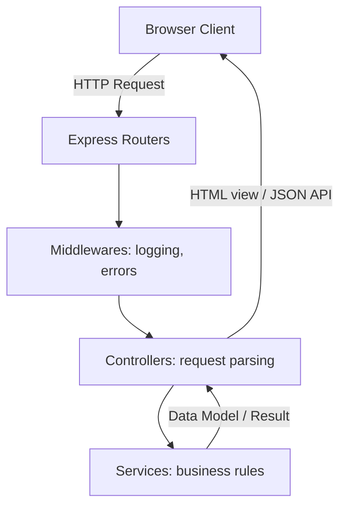

# HomeoVault Architecture Design

This document details the architectural guidelines, component responsibilities, and request lifecycles in the **HomeoVault** application.

---

## Architectural Philosophy
HomeoVault is designed around a clean, layered architecture separating the delivery mechanism (HTTP/Express) from the business rules and state management.

---

## Layer Responsibilities

### 1. Delivery & Router Layer (`app.js`, `backend/routes/`)
- Intercepts incoming HTTP requests.
- Maps endpoints to corresponding controllers.
- Mounts global configurations (static assets, parsers).

### 2. Controller Layer (`backend/controllers/`)
- Extrudes parameters from request inputs (query params, bodies, headers).
- Delegates computation to the Service layer.
- Formats responses using status codes, serving HTML layouts or returning standard JSON.
- Handled safely via the `asyncHandler` wrapper.

### 3. Service Layer (`backend/services/`)
- Houses raw business logic separate from transport protocols.
- Interacts with future persistence layers (PostgreSQL).
- Agnostic to Express objects (`req`, `res`).

### 4. Middleware Layer (`backend/middleware/`)
- Performs pipeline operations before requests reach controllers (e.g. logging) or handles post-controller actions (e.g., error management).

### 5. Utility Layer (`backend/utils/`)
- Reusable modules for logging, timing, and structural wrapping.

---

## Error Handling Lifecycle
Uncaught system failures are managed systematically to avoid crashes or memory leaks:

1. **Async Operations**: Controllers wrap handlers in `asyncHandler`. Any rejected promises are caught and sent to `next(err)`.
2. **Global Catch-All**: The `error.middleware.js` interceptor inspects the error.
3. **Response Splitting**:
   - For `/api` requests: sends a normalized JSON payload `{ success: false, error: { message, status } }`.
   - For page requests: reads `views/error.html`, replaces tags with the error message and call stack (in dev mode), and returns the HTML layout.

---

## Styling & Layout System
All UI components use custom tokens in `public/css/styles.css`:
- **Theme tokens**: Defined globally via CSS Variables (colors, fonts, radii, spacing).
- **Responsive design**: Driven by mobile-first media queries and CSS grid systems rather than third-party frameworks.
- **Micro-animations**: Cards use transition scaling, toasts slide in dynamically, and buttons scale slightly on active press states to elevate visual quality.
