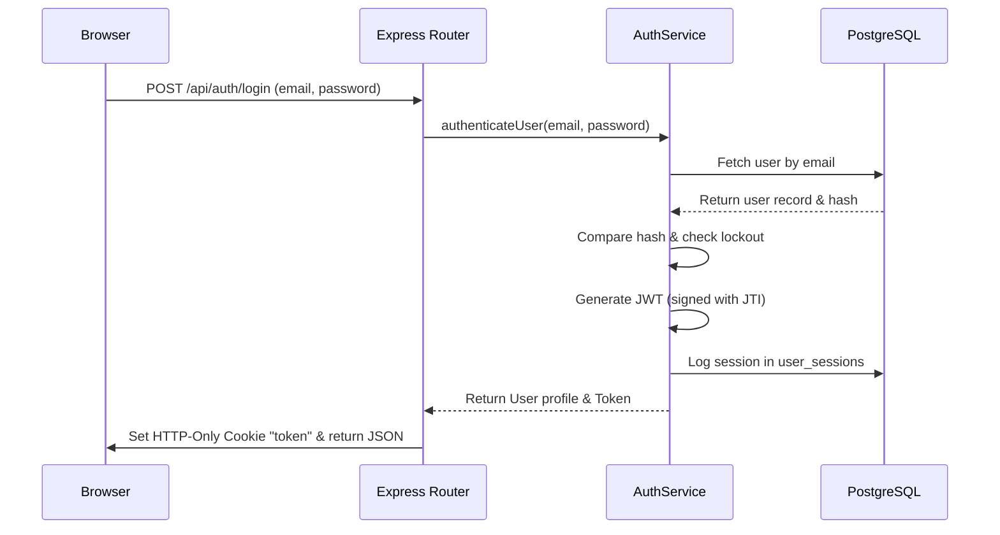

# HomeoVault Authentication & Security Specifications

This document describes the security policies, authentication mechanisms, token lifecycles, and route protection guards implemented in the **HomeoVault** application.

---

## 1. Authentication & Session Flow
Authentication combines stateless client-side JWT authorization with database audit session records for enhanced tracking and single-session termination.

### Key States:
1.  **Register (`POST /api/auth/register`)**: Creates a user with a `Family Member` role (or matching input) and hashes the password via `bcrypt`.
2.  **Login (`POST /api/auth/login`)**: Performs credentials comparison, increments failures on error, generates token on success, and logs the session in the `user_sessions` table.
3.  **Logout (`POST /api/auth/logout`)**: Sets `is_active = false` and updates `logout_time` on the session row. Clears the client cookie.

---

## 2. Password Hashing & Security Policy
*   **Hash Algorithm**: `bcrypt` (10 rounds of salt generation).
*   **Password Policy**:
    *   Minimum Length: 8 characters.
    *   Must contain at least one lowercase letter (`[a-z]`).
    *   Must contain at least one uppercase letter (`[A-Z]`).
    *   Must contain at least one digit (`[0-9]`).
    *   Must contain at least one special symbol (non-alphanumeric, e.g., `@`, `#`, `!`).
*   **Implementation**: Validated using `express-validator` filters on routes before arriving at controllers.

---

## 3. Account Lockout Mechanism (Brute-Force Prevention)
To protect user cabinets from dictionary or brute-force attacks:
- **Attempts Limit**: A maximum of **5 consecutive failed login attempts** is permitted.
- **Lockout Action**: On the 5th failure, the `locked_until` database timestamp is updated to **15 minutes in the future**.
- **Access Block**: Submitting logins while `locked_until > CURRENT_TIMESTAMP` fails with an immediate message reporting the remaining lock time.
- **Auto-Unlock**: Attempts made after the 15-minute window automatically reset `login_attempts` to 0 on success.

---

## 4. JSON Web Tokens (JWT) Flow
JWTs authorize subsequent client API requests statelessly:
*   **Claims**:
    - `id`: The unique UUID of the user.
    - `email`: User's primary email.
    - `role_name`: Role mapping (e.g. Administrator).
    - `jti`: A unique UUID session identifier to match against the `user_sessions` table.
*   **Lifetime**: 24 hours.
*   **Storage**: Handled using `HttpOnly`, `SameSite=Lax` cookies, shielding the token from client-side script inspection (mitigating XSS vulnerabilities).

---

## 5. Protected Routes & Middlewares

### 1. `authenticate` Middleware (`auth.middleware.js`)
Guards user-only resources.
1.  Checks headers (`Authorization: Bearer <token>`) or cookies (`req.cookies.token`).
2.  Verifies the JWT signature against `JWT_SECRET`.
3.  Queries `user_sessions` to ensure the session with matching `jti` is active.
4.  Queries `users` to confirm the user exists and is active.
5.  Attaches the user row payload to `req.user` for downstream handlers.

### 2. `authorize(...roles)` Middleware (`role.middleware.js`)
Controls role-based endpoint permissions (RBAC).
- Requires `authenticate` to run first.
- Inspects `req.user.role_name`.
- Blocks execution and returns a `403 Forbidden` response if the role name is not present in the allowed list.

---

## 6. Administrative Route Table

Only users with the **`Administrator`** role are permitted to run the following endpoints:

| Method | Endpoint | Description |
| :--- | :--- | :--- |
| `GET` | `/api/users` | List all users with active statuses and roles. |
| `PUT` | `/api/users/:id/status` | Activate or deactivate a target user account. |
| `DELETE` | `/api/users/:id` | Soft-delete a user account (sets `is_active = false`). |
