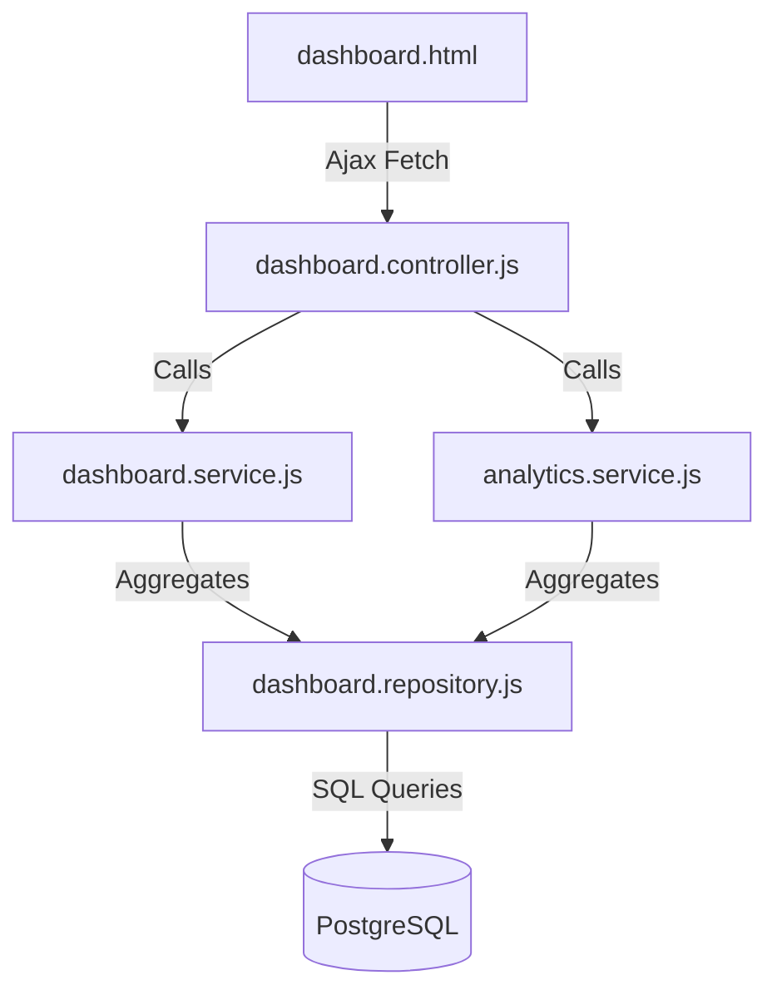

# HomeoVault Dashboard & Analytics Architecture Documentation

This document describes the dashboard layout, KPI aggregation strategies, analytical queries, Chart.js generation matrices, and database query optimizations implemented in the **Dashboard & Analytics** module.

---

## 1. Dashboard System Architecture

The dashboard is structured on a model-view-service pattern that loads data asynchronously, showing loading skeletons while requests fetch:



### Key UI Features:
-   **Loading skeletons**: Visual shimmer blocks are shown on cards and tables while the API requests load, preventing UI shifts.
-   **Animated Counters**: Counters (e.g. Total remedies) run a requestAnimationFrame loop to increment counts from 0 to their target value smoothly.

---

## 2. Analytics Aggregations

To compute charts datasets efficiently, SQL statements combine groupings and counts inside single requests:

### A. Monthly stock movements:
Counts positive (`STOCK_IN`) and absolute negative (`STOCK_OUT`) quantities grouped by year/month:
```sql
SELECT TO_CHAR(transaction_date, 'YYYY-MM') as month,
       SUM(CASE WHEN transaction_type = 'STOCK_IN' THEN quantity ELSE 0 END) as stock_in,
       SUM(CASE WHEN transaction_type = 'STOCK_OUT' THEN ABS(quantity) ELSE 0 END) as stock_out
FROM stock_transactions
WHERE transaction_date >= CURRENT_DATE - INTERVAL '6 months'
GROUP BY TO_CHAR(transaction_date, 'YYYY-MM')
ORDER BY month ASC;
```

### B. Category distribution:
Computes remedy counts per category:
```sql
SELECT c.name as category_name, COUNT(m.id) as medicine_count
FROM medicine_categories c
LEFT JOIN medicines m ON c.id = m.category_id AND m.is_active = true
WHERE c.is_active = true
GROUP BY c.id, c.name
ORDER BY medicine_count DESC;
```

### C. Inventory Valuation:
Computes total asset values using both purchase cost and MSRP:
```sql
SELECT 
  SUM(available_quantity * purchase_price) as total_purchase_value,
  SUM(available_quantity * mrp) as total_mrp_value
FROM inventory_batches
WHERE available_quantity > 0;
```

---

## 3. Chart.js Configurations

Charts are rendered dynamically on standard HTML5 canvas wrappers using **Chart.js** version 4.

1.  **Monthly Trends (Bar Chart)**: Binds labels list (`['2026-02', '2026-03', ...]`) and datasets for Stock In (Green) and Stock Out (Red).
2.  **Category Distribution (Pie Chart)**: Lists category names and maps medicine counts to slices.
3.  **Top Consumed Remedies (Horizontal Bar Chart)**: Binds medicine names to y-axis labels and total consumed quantities to x-axis columns.
4.  **Most Stocked Remedies (Doughnut Chart)**: Visualizes the top 5 stocked medicine potency combinations.

---

## 4. Query Performance Optimizations

To handle thousands of records without degrading server response times:
1.  **Covering Indexes**: Migrations apply indexes on:
    -   `stock_transactions(transaction_date)` (for fast monthly ranges and daily counts).
    -   `inventory_batches(expiry_date, available_quantity)` (for expiring batches).
    -   `inventory(current_quantity, reorder_level)` (for low stock sweeps).
2.  **Parallel Promise Resolution**: The controller routes fetch summaries, activities, and charts concurrently using `Promise.all()`, utilizing the database connection pool.
3.  **Aggregation Caching**: Chart queries group transactions at the database level rather than downloading raw ledgers and calculating arrays in Node.js memory.
