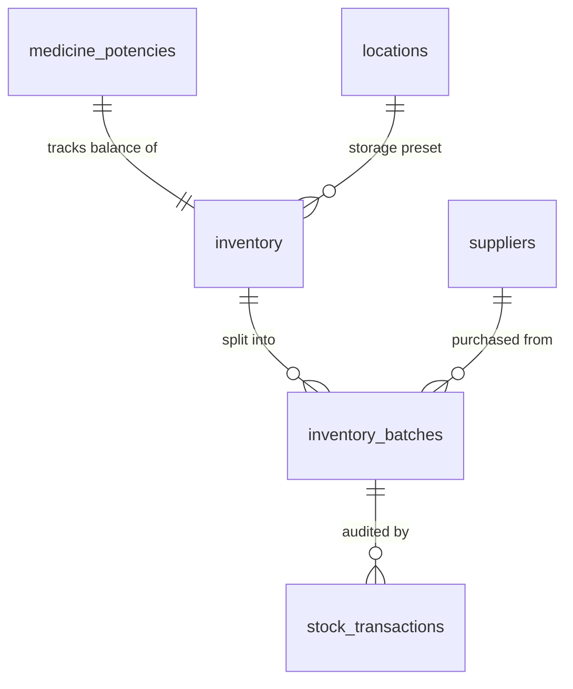

# HomeoVault Inventory Management Documentation

This document describes the inventory storage models, transactional stock movement workflows, batch handling rules, and API routes of the **Inventory Management** module.

---

## 1. Inventory & Batch Data Model
To permit tracking specific expiration dates, manufacture lot codes, and purchase prices without inflating core remedy records:
- **Parent Inventory (`inventory`)**: Stores the total accumulated quantity balance of a medicine-potency combination.
- **Child Batches (`inventory_batches`)**: Stores distinct manufacturing lots linked to the parent. Each lot maintains its own `available_quantity` and `expiry_date`.



---

## 2. Stock Movement Workflows

All stock movements (Stock-In, Stock-Out, Adjustments) are run within transactional database clients to guarantee strict inventory consistency.

### A. Stock In Flow (`POST /api/inventory/stock-in`)
- Checks if parent `inventory` row exists for the `medicine_potency_id`. If not, creates it.
- Checks if a batch with the same number already exists for this inventory item:
  - If yes, merges the quantities (increments `quantity` and `available_quantity`).
  - If no, creates a new `inventory_batches` record.
- Increments `current_quantity` on the parent `inventory` record.
- Records a `STOCK_IN` transaction pointing to the batch.

### B. Stock Out Flow (`POST /api/inventory/stock-out`)
- Fetches and locks the batch row: `SELECT * FROM inventory_batches WHERE id = $1 FOR UPDATE`.
- Validates that `available_quantity >= requested_quantity`. If not, throws an error and rolls back the transaction.
- Subtracts `requested_quantity` from the batch's `available_quantity`.
- Subtracts `requested_quantity` from the parent `inventory`'s `current_quantity`.
- Records a `STOCK_OUT` transaction pointing to the batch.

### C. Quantity Adjustments (`POST /api/inventory/adjust`)
- Fetches the batch.
- Computes quantity difference: `diff = new_quantity - available_quantity`.
- Updates batch's `available_quantity = new_quantity`.
- Updates parent `inventory`'s `current_quantity = current_quantity + diff`. If this pushes it below 0, rolls back the transaction.
- Records an `ADJUSTMENT` transaction with quantity `diff` pointing to the batch.

---

## 3. Alerts & Tracking

### A. Expiry Alerts (`GET /api/inventory/expiry`)
Queries active batches whose expiration date is approaching:
```sql
SELECT ib.*, m.name as medicine_name, p.name as potency_name
FROM inventory_batches ib
JOIN inventory i ON ib.inventory_id = i.id
JOIN medicine_potencies mp ON i.medicine_potency_id = mp.id
JOIN medicines m ON mp.medicine_id = m.id
JOIN potencies p ON mp.potency_id = p.id
WHERE ib.expiry_date <= CURRENT_DATE + (CAST($1 AS INTEGER) * INTERVAL '1 day')
  AND ib.available_quantity > 0
ORDER BY ib.expiry_date ASC;
```

### B. Low Stock Alerts (`GET /api/inventory/low-stock`)
Queries medicines whose aggregate balance drops below their warning thresholds:
```sql
SELECT i.*, m.name as medicine_name, p.name as potency_name
FROM inventory i
JOIN medicine_potencies mp ON i.medicine_potency_id = mp.id
JOIN medicines m ON mp.medicine_id = m.id
JOIN potencies p ON mp.potency_id = p.id
WHERE i.current_quantity <= i.reorder_level;
```

---

## 4. API Endpoints Table

All endpoints require authentication (HttpOnly cookie validation).

| Method | Endpoint | Description |
| :--- | :--- | :--- |
| `GET` | `/api/inventory` | List aggregate stock balances with search/filters. |
| `GET` | `/api/inventory/:id` | Fetch inventory details and active batches. |
| `GET` | `/api/inventory/low-stock` | Retrieve medicines below reorder thresholds. |
| `GET` | `/api/inventory/expiry` | Retrieve batch lots nearing expiration. |
| `GET` | `/api/inventory/history` | Retrieve chronological ledger of stock movements. |
| `POST` | `/api/inventory/stock-in` | Receive new remedy stock batch lots. |
| `POST` | `/api/inventory/stock-out` | Record stock consumption or lot disposals. |
| `POST` | `/api/inventory/adjust` | Adjust a lot quantity (logs differential records). |
| `POST` | `/api/inventory/transfer` | Move remedies between cabinet boxes. |
| `GET` | `/api/locations` | List available cabinet storage drawers. |
| `POST` | `/api/locations` | Add a new cabinet storage location. |
| `GET` | `/api/suppliers` | List pharmacy distributors. |
| `POST` | `/api/suppliers` | Register a new supplier distributor. |
