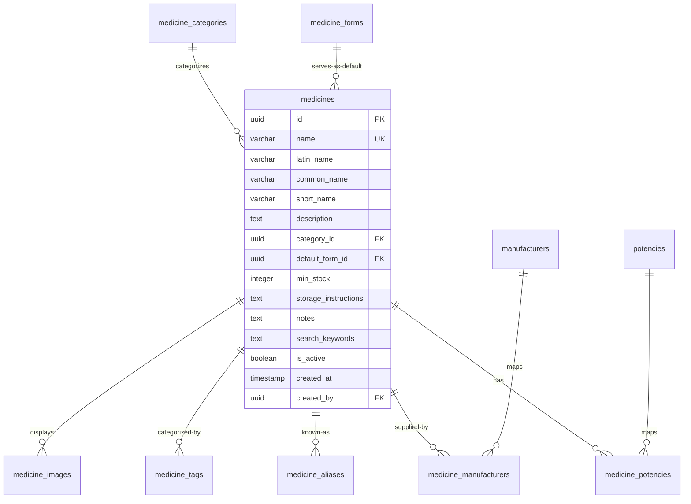
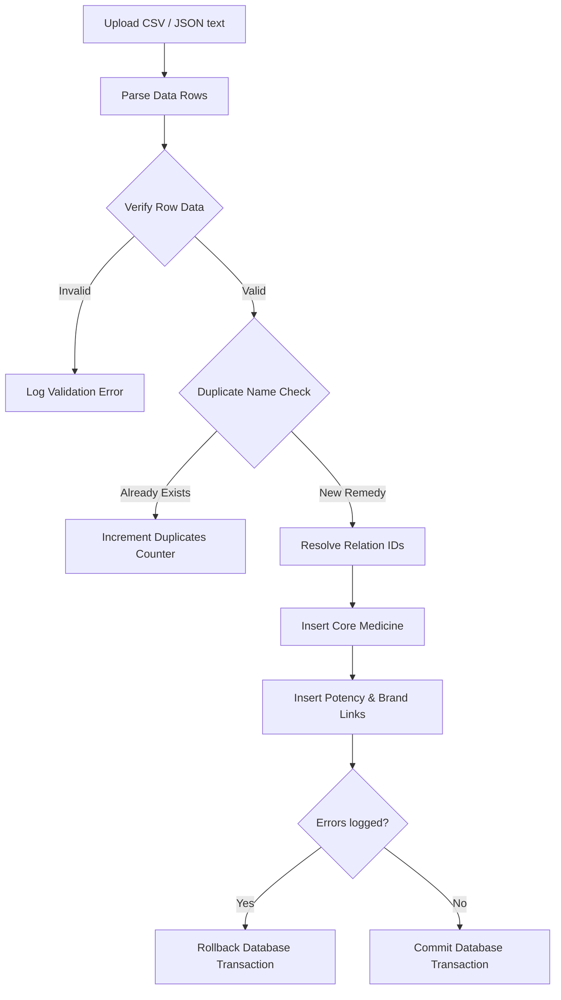

# HomeoVault Homeopathic Medicine Master Documentation

This document describes the database design, normalization models, search engine mechanics, bulk data import coordinator, and API routes of the **Medicine Master** module.

---

## 1. Database Schema Design & Relationships

To prevent redundancy, the database is normalized to ensure that remedies are NOT duplicated per potency. Multiple potencies, manufacturers, aliases, and tags are linked to a core medicine record through mapping tables.

### Table Definitions:
1.  **`medicine_categories`**: Global groups (e.g. Single Remedy, Mother Tincture, Tissue Salts).
2.  **`medicine_forms`**: Formulation forms (e.g. Globules, Tablet, Drops, Ointment).
3.  **`potencies`**: Common homeopathic potencies (e.g. 30C, 200C, 1M, Q) with sorting display orders.
4.  **`manufacturers`**: Laboratory brands (e.g. SBL, Dr Reckeweg, Adel, Schwabe).
5.  **`medicine_potencies` & `medicine_manufacturers`**: Join tables connecting multiple options to a single medicine ID.
6.  **`medicine_aliases` & `medicine_tags`**: Key-value arrays matching dynamic lookups.

---

## 2. Bulk Data Import Engine

To allow loading 4,000–5,000 remedy records cleanly, the import coordinator (`import.service.js`) executes uploads within an isolated transaction.

### Critical Integrity Rules:
-   **ACID Transactions**: If a single row fails database constraints or triggers database errors, the *entire* transaction is rolled back, preventing orphaned rows.
-   **Dynamic Resolvers**: Category, form, manufacturer, and potency strings (e.g. "Arnica Category", "SBL", "30C") are automatically created in the lookup tables if they don't exist yet.
-   **Duplicate Protection**: Core medicine names are matched using case-insensitive checks. If a record already exists, it is logged and skipped without throwing a fatal exception (permitting subsequent rows to load).

---

## 3. Search Engine Architecture
The search engine is implemented in `search.service.js` using SQL string constructors matching:
1.  **Fuzzy Contains**: Performs case-insensitive matching across `name`, `latin_name`, `common_name`, and `short_name`.
2.  **Lookup Joins**: Joins aliases and tags tables to return medicines matching related terms.
3.  **Relational Filters**: Filters grids by category, form, manufacturer, or potency.
4.  **Autocomplete suggestions**: Returns fast starting-characters queries (`ILIKE 'query%'`) to show hints as users type.

---

## 4. API Endpoints Table

All endpoints require authentication (HttpOnly Cookie verification).

| Method | Endpoint | Authorization | Description |
| :--- | :--- | :--- | :--- |
| `GET` | `/api/medicines` | All users | List paginated catalog medicines. |
| `GET` | `/api/medicines/search` | All users | Advanced filter/autocomplete search queries. |
| `GET` | `/api/medicines/:id` | All users | Fetch medicine details (joins potencies, brands). |
| `GET` | `/api/categories` | All users | Fetch list of active medicine categories. |
| `GET` | `/api/potencies` | All users | Fetch list of active potencies (display order). |
| `GET` | `/api/manufacturers` | All users | Fetch list of active laboratory brands. |
| `POST` | `/api/import/medicines` | Administrator | Bulk commit CSV or JSON catalog data. |
