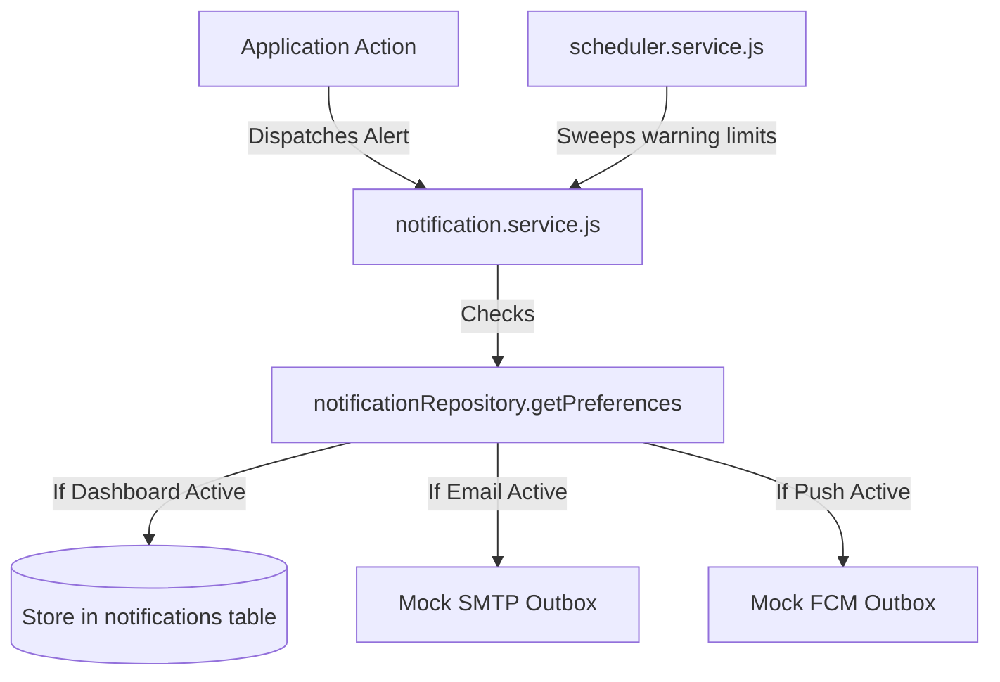

# HomeoVault Notifications, Alerts & Background Jobs Documentation

This document describes the notification models, user preferences configurations, background task schedulers, audit logger, and SMTP/Push integrations routes.

---

## 1. Notification Architecture

Notifications are dispatched during operations (such as Stock-In, Stock-Out, or catalog uploads) and background sweeps:



### Notification Types Table:
-   `LOW_STOCK` / `OUT_OF_STOCK`: Reminds users when stock is low or empty.
-   `EXPIRED` / `EXPIRY_7` / `EXPIRY_30` etc.: Expiring batch lots.
-   `STOCK_IN` / `STOCK_OUT` / `ADJUSTMENT`: Transaction event tracking.
-   `SYSTEM_ERROR`: Application exceptions.

---

## 2. Background Scheduler Architecture

Background jobs run on a loop managed by `scheduler.service.js`:
-   **Hourly loop**: Initiated via `setInterval` inside `server.js` on startup. Runs checks sequentially:
    -   `checkLowStock()`: Scans items below safety limits and logs notifications.
    -   `checkExpiry()`: Runs warnings checks for lots expiring in 7, 30, 60, and 90 days.
    -   `cleanOldSessions()`: Clears expired sessions.
    -   `cleanTemporaryFiles()`: Deletes temporary upload items.
    -   `updateDashboardStatistics()`: Refreshes statistics cache.
-   **Manual executions**: Operators can force jobs to run on-demand via the settings view (calling `POST /api/jobs/run`).
-   **Graceful shutdowns**: When server exits (`SIGTERM`, `SIGINT`), `scheduler.stop()` is triggered to clear background intervals.

---

## 3. Database Audit Logging

Database audits are managed by `systemLog.service.js`. Standard calls write logs to `system_logs`:
```javascript
import systemLogService from './systemLog.service.js';

// Examples:
await systemLogService.info('INVENTORY', 'Medicine stock-in batch completed.');
await systemLogService.error('SCHEDULER', 'Failed executing expiration check.', err.stack);
```
Indexes on `(log_level, category)` and `created_at DESC` allow rapid audits filtering.

---

## 4. Future Integrations Channels

### A. SMTP Email Integrations
To connect real email gateways:
1.  Install a mail package: `npm install nodemailer`.
2.  Configure SMTP credentials in `.env` (SMTP_HOST, SMTP_PORT, SMTP_USER, SMTP_PASS).
3.  Implement a mail transporter in `notification.service.js` under `sendEmail(userId, title, message)`:
    ```javascript
    import nodemailer from 'nodemailer';
    // Inside notification.service.js:
    const transporter = nodemailer.createTransport({ host: process.env.SMTP_HOST, ... });
    await transporter.sendMail({ to: userEmail, subject: title, text: message });
    ```

### B. Mobile Push Notifications
To connect push gateways (Firebase FCM or Apple Push Notifications APNS):
1.  Install the Firebase Admin SDK: `npm install firebase-admin`.
2.  Initialize the Firebase application using service account credentials.
3.  Implement in `notification.service.js` under `sendPush(userId, title, message)`:
    ```javascript
    import admin from 'firebase-admin';
    // Inside notification.service.js:
    await admin.messaging().send({
      token: userDeviceToken,
      notification: { title, body: message }
    });
    ```
