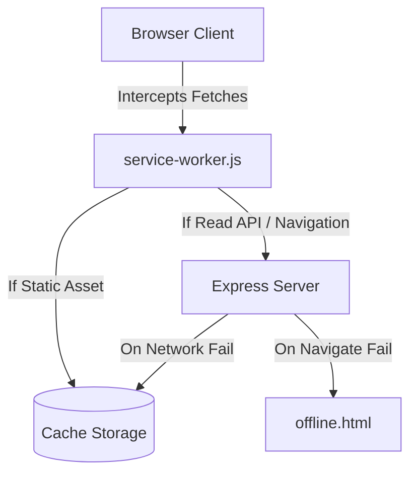

# HomeoVault Progressive Web App (PWA) Documentation

This document describes the offline architecture, caching strategies, and install/connection banners implemented in the **PWA & Optimization** module.

---

## 1. PWA System Architecture

The Progressive Web App integration enables **HomeoVault** to load instantly, work offline, and behave like a native desktop application.

---

## 2. Service Worker Caching Strategies

The service worker (`service-worker.js`) intercepts all HTTP GET requests and applies tailored caching rules based on request destination:

### A. Cache-First with Stale-While-Revalidate (Static Assets)
-   **Applies to**: Stylesheets, core JS libraries, icon PNGs, logo SVGs.
-   **Behavior**: Checks the cache. If found, returns the cached version immediately (speeding up page load time). Simultaneously sends a background network request to fetch the latest version, warming the cache for subsequent visits.

### B. Network-First with Cache Fallback (API Calls)
-   **Applies to**: Analytics statistics summaries, catalog lookup results.
-   **Behavior**: Always requests the latest numbers from the Express API to guarantee accuracy. If the user is offline, catches the fetch exception and returns the last cached response.

### C. Network-First with Offline Fallback (Navigation pages)
-   **Applies to**: Page navigation (e.g. `/dashboard`, `/inventory.html`).
-   **Behavior**: Attempts to load the live page. If the connection fails, intercepts the navigation request and returns the pre-cached `/offline.html` page warning.

---

## 3. UI Connection & Installation Banners

-   **Install Banner**: Listens to the browser's `beforeinstallprompt` event. If the system is installable, displays a custom floating card prompting the operator to install the HomeoVault native app.
-   **Connectivity Banners**: Listens to standard `online` and `offline` events. If connection fails, spawns a sticky warning bar at the bottom of the screen. When connection restores, updates the banner and refreshes state.
-   **Update Notification**: Displays a top alert when a new service worker update is downloaded, allowing users to hot-reload.
