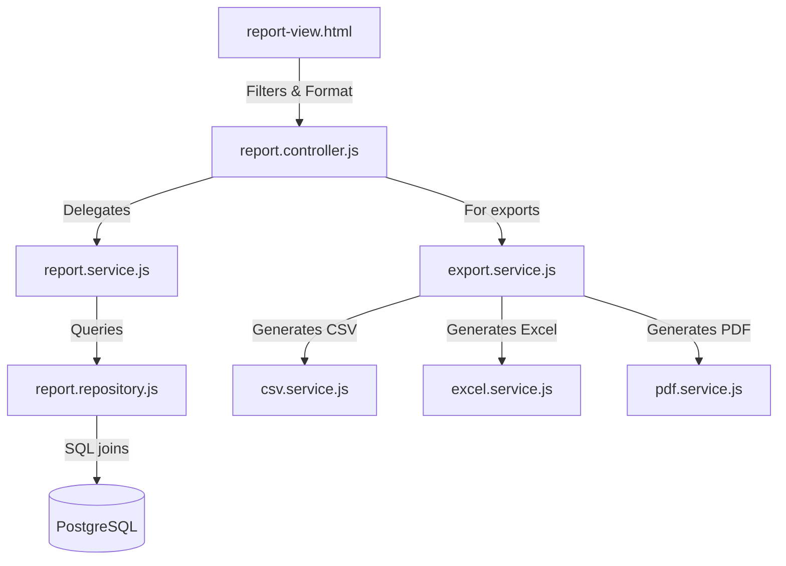

# HomeoVault Reports & Export Architecture Documentation

This document describes the design, print layouts, and export engines implemented in the **Reports & Export** module.

---

## 1. Reports Architecture

The Reports module handles data collection and filtering asynchronously:



### Key UI Features:
-   **Dynamic Filters**: Side inputs adjust automatically depending on the target report key (e.g. date range picker for stock-in/out, status checkboxes for expiry lists).
-   **Printer-Friendly Stylesheets**: In `reports.css`, `@media print` rules strip navbars, header bars, side filter cards, and pagination boxes, adapting the remaining data grid table to fit A4 margins.

---

## 2. Export Generation Engines

Exports are generated in pure Node.js without calling heavy unverified packages:

### A. CSV Exporter (`csv.service.js`)
Iterates columns titles and row maps, joining values using standard commas, and escaping quotes:
```javascript
const csvText = exportToCsv(mappedData, columnTitles);
return Buffer.from(csvText, 'utf-8');
```

### B. Excel Exporter (`excel.service.js`)
Assembles a valid **Microsoft Office XML spreadsheet**. The file returns a formatted HTML structure containing sheet names, column dimensions, table headers, gridline options, and row values. When opened in Excel, the file is parsed as a styled spreadsheet.

### C. PDF Exporter (`pdf.service.js`)
Constructs a valid **PDF Document Version 1.4** using pure JavaScript. It compiles page streams, font dictionary resources (Helvetica and Helvetica-Bold), metadata headers, text operations, cross-reference tables (`xref`), and catalog trailers. Each page displays up to 40 row items and handles page coordinates.

---

## 3. Query Performance Optimizations

To handle larger collections without degrading server response times:
1.  **Date Boundaries**: Queries utilize indexes on transaction log timestamps:
    -   `CREATE INDEX IF NOT EXISTS idx_transactions_date ON stock_transactions(transaction_date);`
2.  **Valuation Aggregations**: Financial valuations aggregate values directly in PostgreSQL (`available_quantity * purchase_price` and `available_quantity * mrp`) rather than processing calculations in application memory.
3.  **Covering Indexes**:
    -   `inventory_batches(expiry_date, available_quantity)` handles rapid expiration lookups.
4.  **Paginated Queries**: Screen displays limit query size (using `LIMIT` and `OFFSET` clauses) while exports ignore page sizes to write complete collections.
