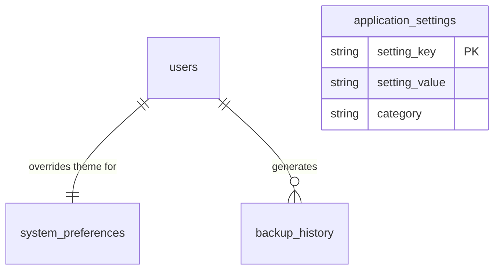

# HomeoVault Settings, Backup & Restore Architecture Documentation

This document describes the settings configurations schemas, serialization backup engines, and transaction-safe database restore procedures implemented in the **Settings, Backup & Restore** module.

---

## 1. Settings & Preferences Architecture

Configurations are split into two tiers:
1.  **Global Application Settings (`application_settings`)**: System-wide properties (e.g. application name, date formatting style, base currency symbol, and low stock threshold limits) saved as key-value text lines.
2.  **Personal System Preferences (`system_preferences`)**: Personal overrides (e.g. active color themes, preferred language, and landing redirection routes) bound to user profiles.



---

## 2. Backup & Export Engine (`backup.service.js`)

Offline backups package complete application state parameters in a single portable JSON file.

### Process Flow:
1.  Queries all catalog and transactional data tables:
    -   `application_settings`
    -   `medicine_categories`
    -   `manufacturers`
    -   `medicine_forms`
    -   `potencies`
    -   `medicines`
    -   `medicine_potencies`
    -   `locations`
    -   `suppliers`
    -   `inventory`
    -   `inventory_batches`
    -   `stock_transactions`
2.  Serializes table arrays into a structured JSON map:
    ```json
    {
      "version": "1.0.0",
      "timestamp": 1785532000000,
      "tables": {
        "medicines": [...],
        "inventory": [...]
      }
    }
    ```
3.  Writes the JSON content to the workspace directory `/backups/` using `fs.writeFileSync`.
4.  Logs metadata (filename, bytes size, operator) to the `backup_history` database audit table.

---

## 3. Transactional Restore Mechanics (`restore.service.js`)

To prevent partial database states during restoration, the process runs within an isolated PostgreSQL transaction block.

### Execution sequence:
1.  **Format Verification**: Validates that incoming file matches version `'1.0.0'` and carries all expected database tables.
2.  **Cascade Truncation**: Deletes current database rows in reverse dependency order (child tables first) using:
    `TRUNCATE TABLE ... CASCADE;`
3.  **Sequential Insertion**: Loops table arrays in dependency order, compiling insertion sql statements (parent tables first).
4.  **Transaction Safety**:
    -   If all rows insert cleanly, triggers `COMMIT` to save updates.
    -   If any syntax mismatch, unique constraint error, or validation failure occurs, triggers a `ROLLBACK` to revert the database state.
